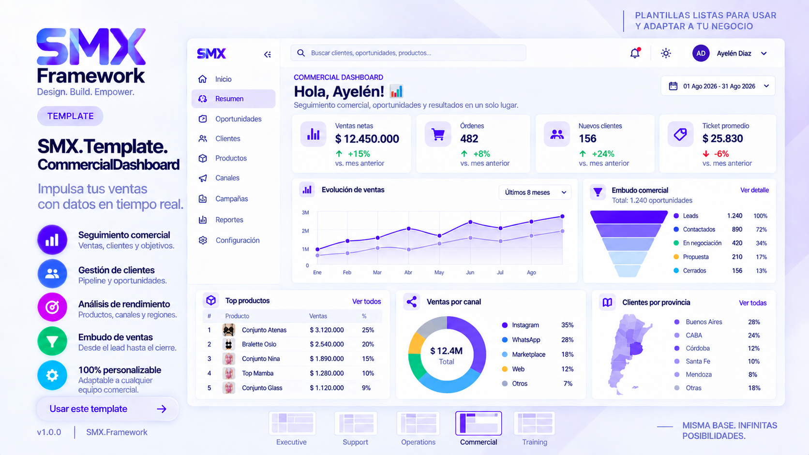

# SMX.Template.CommercialDashboard

A complete commercial dashboard template built with **SMX Framework**.

---

# Overview

Commercial Dashboard is designed for sales teams, business managers and executives who need a complete overview of commercial performance.

The template includes sales KPIs, customer analytics, regional analysis, channel performance and product rankings.

---

# Features

- Executive KPI Cards
- Monthly Sales Trends
- Commercial Funnel
- Product Ranking
- Province Sales Map
- Sales by Channel
- Customer Analytics
- Interactive Filters
- Responsive Layout

---

# Included Components

- SMX.PageHeader
- SMX.Sidebar
- SMX.KPI
- SMX.GraphCard
- SMX.FilterPanel
- SMX.Table
- SMX.Ranking

---

# Recommended Scenarios

- Commercial Management
- Sales Teams
- Business Intelligence
- Retail
- Ecommerce
- Executive Reporting

---

# Power BI

Power BI resources are available inside:

powerbi/

---

# Wireframes

Desktop and mobile wireframes are available inside:

wireframes/

---

# Version

1.0.0