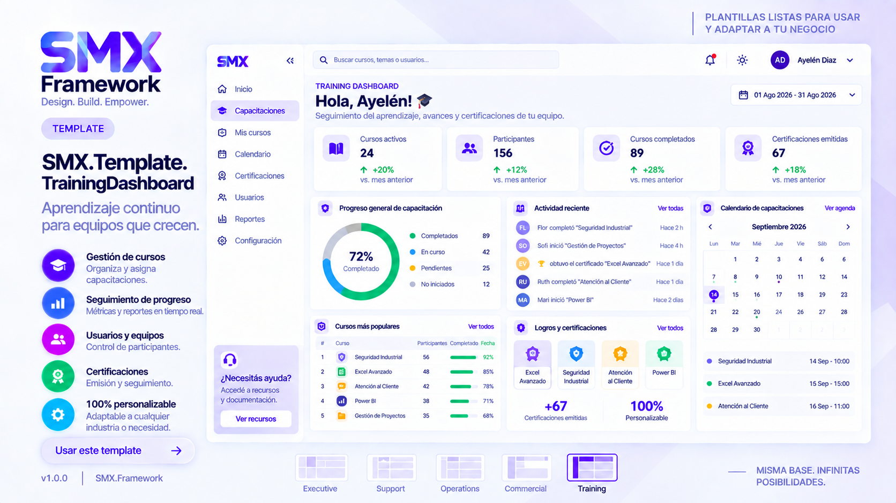

# SMX.Template.TrainingDashboard

Training Dashboard is a reusable dashboard template developed with the **SMX Framework**.

---

# Overview

Designed to monitor employee training, certifications and learning progress.

Ideal for HR, Learning & Development and corporate universities.

---

# Features

- Training KPIs
- Learning Progress
- Certifications
- Timeline
- Course Ranking
- Calendar
- Interactive Filters
- Responsive Layout

---

# Included Components

- SMX.PageHeader
- SMX.Sidebar
- SMX.KPI
- SMX.GraphCard
- SMX.FilterPanel
- SMX.Table
- SMX.Timeline

---

# Recommended Scenarios

- Human Resources

- Corporate Universities

- Internal Training

- Compliance

- Learning Analytics

---

# Power BI

Power BI resources are located in

powerbi/

---

# Wireframes

Desktop and Mobile wireframes are included.

---

# Version

1.0.0